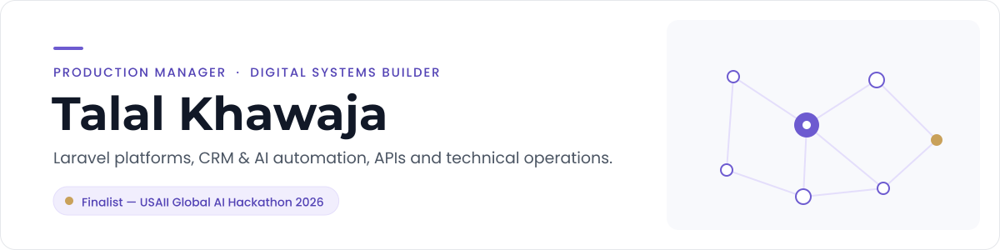

<a href="https://talalkhawaja.com">
  <picture>
    <source media="(prefers-color-scheme: dark)" srcset="assets/banner-dark.svg">
    <source media="(prefers-color-scheme: light)" srcset="assets/banner-light.svg">
    
  </picture>
</a>

  <a href="https://talalkhawaja.com"><b>talalkhawaja.com</b></a> ·
  <a href="https://teqprotech.com">teqprotech.com</a> ·
  <a href="https://www.linkedin.com/in/talalkhawaja/">LinkedIn</a> ·
  <a href="https://devpost.com/Kmt9967">Devpost</a> ·
  <a href="https://lablab.ai/u/@kmt9967">lablab.ai</a> ·
  <a href="https://orcid.org/0009-0000-3258-1557">ORCID</a>

I'm **Talal Khawaja**, a Production Manager and digital systems builder. I build systems that keep working without supervision: Laravel platforms, CRM and AI automation, API integrations and the technical operations that keep them running. Where a decision matters, the AI proposes and a person approves.

- **Production Manager (CRM & automation operations)** since March 2025: GoHighLevel automation, AI booking bots, integrations, email deliverability and web builds.
- **Founder of [Teqprotech](https://teqprotech.com)** since September 2021, a small remote web-development studio.
- **Full-stack developer (PHP / Laravel)** since 2020.

## What I work on

| Area | In practice |
|---|---|
| **Laravel & PHP** | Production web platforms. [talalkhawaja.com](https://talalkhawaja.com) and [teqprotech.com](https://teqprotech.com) run on one domain-aware Laravel 12 app with a Filament admin. |
| **Python** | FastAPI services and agents ([ThesisCircuit](https://github.com/kmt9967/thesiscircuit), [NeighborOps AI](https://github.com/kmt9967/neighborops-ai)), plus automation scripts. |
| **GoHighLevel & CRM** | Workflows, pipelines, AI booking bots, lead routing and reporting for day-to-day operations. |
| **APIs & integrations** | Connecting CRMs, forms, telephony, email and AI services so data moves without copy-paste. |
| **AI automation** | Agents that call deterministic tools and stop for a person at the decisions that matter. |
| **Workflow automation** | Triggers, schedules and hand-offs that remove repetitive work from a team's day. |
| **WordPress** | Business sites, maintenance and fixes. |
| **Application development** | TypeScript and Next.js builds, from hackathon prototypes to deployed demos. |
| **Technical operations** | CI/CD with GitHub Actions, backups and health-checked deploys, email deliverability, monitoring. |

## Featured project

<!-- FEATURED:START -->
### CivicAI Readiness Blueprint

**Finalist — USAII Global AI Hackathon 2026**

An AI decision-support dashboard for community AI readiness. Transparent local scoring finds the gaps, scenarios can be compared side by side, and the output is a three-phase responsible-AI roadmap with explicit human decision points. The model advises; people decide.

**Stack:** Next.js, TypeScript, OpenAI SDK, Recharts · **Last updated:** 28 Sep 2026

[Repository](https://github.com/kmt9967/civicai-readiness-blueprint) · [Case study](https://talalkhawaja.com/projects/civicai-readiness-blueprint) · [Live demo](https://civicai-readiness-blueprint.vercel.app) · [Devpost](https://devpost.com/software/civicai-readiness-blueprint)
<!-- FEATURED:END -->

## Achievements

<!-- ACHIEVEMENTS:START -->
- **Finalist — USAII Global AI Hackathon 2026** for [CivicAI Readiness Blueprint](https://talalkhawaja.com/projects/civicai-readiness-blueprint): AI decision-support dashboard for community AI readiness, with a three-phase responsible-AI roadmap and human decision points.

| Platform | Snapshot | Last verified |
|---|---|---|
| [lablab.ai](https://lablab.ai/u/@kmt9967) | Elite level · 3,865 points · Leaderboard #15 · 10 events · 5 submissions | 2026-09-30 |
| [Devpost](https://devpost.com/Kmt9967) | 6 hackathons · 8 projects | 2026-09-27 |

Platform numbers are dated snapshots, not live counters.

**Hackathon entries (2026)**

| Project | Event | Result | Team | Links |
|---|---|---|---|---|
| **LockSmith** | IBM Bob 2.0 Hackathon · lablab.ai · 27 Sep 2026 | Submitted, results pending | Solo | [Repo](https://github.com/kmt9967/locksmith-ibm-bob) · [Case study](https://talalkhawaja.com/projects/locksmith) · [Submission](https://lablab.ai/ai-hackathons/ibm-bob-2-hackathon/teqprotech/locksmith-ibm-bob-fixes-locking-db-migrations) |
| **DUET** | AI Infra Summit Hackathon · lablab.ai · 16 Sep 2026 | Submitted | Team of 4 | [Repo](https://github.com/kmt9967/duet) · [Case study](https://talalkhawaja.com/projects/duet) |
| **NeighborOps AI** | Agents for Humans Hackathon (Good Neighbor Agents track) · Devpost · 14 Sep 2026 | Submitted, results pending | Team of 4, with [Aqeela Urooj](https://github.com/AqeelaUrooj) | [Repo](https://github.com/kmt9967/neighborops-ai) · [Case study](https://talalkhawaja.com/projects/neighborops-ai) · [Submission](https://devpost.com/software/neighborops-ai) |
| **ThesisCircuit** | Alpaca AI Trading Agents Hackathon · lablab.ai · 4 Sep 2026 | Submitted | Team | [Repo](https://github.com/kmt9967/thesiscircuit) · [Case study](https://talalkhawaja.com/projects/thesiscircuit) |
| **ClientOps Memory AI** | CockroachDB × AWS Hackathon: Build with Agentic Memory · Devpost · 15 Aug 2026 | Submitted | With [Aqeela Urooj](https://github.com/AqeelaUrooj) | [Case study](https://talalkhawaja.com/projects/clientops-memory-ai) · [Submission](https://devpost.com/software/clientops-memory-ai) |
| **LaunchMap AI** | AI Factory (native.builder) Hackathon · lablab.ai · 7 Aug 2026 | Submitted | With [Aqeela Urooj](https://github.com/AqeelaUrooj) | [Repo](https://github.com/kmt9967/launchmap-ai) · [Case study](https://talalkhawaja.com/projects/launchmap-ai) · [Submission](https://lablab.ai/submissions/oro4wak74rts313i5diipx0z) |
| **BrandPilot Local** | AMD AI DevMaster Hackathon (Track 1, Multimodal) · GitHub · 5 Aug 2026 | Submitted | With [Aqeela Urooj](https://github.com/AqeelaUrooj) | [Repo](https://github.com/kmt9967/brandpilot-local) · [Case study](https://talalkhawaja.com/projects/brandpilot-local) · [Submission](https://github.com/AMD-DEV-CONTEST/Radeon-hackathon-2026-07/pull/80) |
| **QuotePilot AI** | Global AI Hackathon Series with Qwen Cloud (Track 4) · Devpost · 19 Jul 2026 | Submitted | With [Aqeela Urooj](https://github.com/AqeelaUrooj) | [Repo](https://github.com/kmt9967/quotepilot-ai) · [Case study](https://talalkhawaja.com/projects/quotepilot-ai) · [Submission](https://devpost.com/software/quotepilot-ai) |
| **ScopeGuard AI** | OpenAI Build Week (Work & Productivity) · Devpost · 18 Jul 2026 | Submitted | With [Aqeela Urooj](https://github.com/AqeelaUrooj) | [Repo](https://github.com/kmt9967/scopeguard-ai) · [Case study](https://talalkhawaja.com/projects/scopeguard-ai) · [Submission](https://devpost.com/software/scopeguard-ai) |
| **CaptionForge AI** | AMD Developer Hackathon: ACT II (Track 2) · lablab.ai · 13 Jul 2026 | Submitted | Team of 6, with [Aqeela Urooj](https://github.com/AqeelaUrooj) | [Repo](https://github.com/kmt9967/captionforge-ai) · [Case study](https://talalkhawaja.com/projects/captionforge-ai) |
| **CivicAI Readiness Blueprint** | USAII Global AI Hackathon 2026 · Devpost · 21 Jun 2026 | **Finalist** | With [Aqeela Urooj](https://github.com/AqeelaUrooj) | [Repo](https://github.com/kmt9967/civicai-readiness-blueprint) · [Case study](https://talalkhawaja.com/projects/civicai-readiness-blueprint) · [Submission](https://devpost.com/software/civicai-readiness-blueprint) |

**Certificates**

- [Certificate of Completion (Participant)](https://lablab.ai/u/@kmt9967/ai-hackathons/ibm-bob-2-hackathon/certificate) · lablab.ai · IBM Bob 2.0 hackathon · 28 Sep 2026 (last verified 2026-09-30)
- [Certificate of Completion (Participant)](https://lablab.ai/u/@kmt9967/ai-hackathons/ai-infra-summit-hackathon/certificate) · lablab.ai · AI Infra Summit Hackathon · 22 Sep 2026 (last verified 2026-09-30)
- [Certificate of Completion (Participant)](https://lablab.ai/u/@kmt9967/ai-hackathons/alpaca-ai-trading-agents-hackathon/certificate) · lablab.ai · Alpaca AI Trading Agents Hackathon · 14 Sep 2026 (last verified 2026-09-30)
- [Certificate of Completion (Participant)](https://lablab.ai/u/@kmt9967/ai-hackathons/amd-developer-hackathon-act-ii/certificate) · lablab.ai · AMD Developer Hackathon: ACT II · 13 Aug 2026 (last verified 2026-09-30)
- [Certificate of Completion (Participant)](https://lablab.ai/u/@kmt9967/ai-hackathons/nativebuilder-build-without-limits/certificate) · lablab.ai · AI Factory · 13 Aug 2026 (last verified 2026-09-30)
<!-- ACHIEVEMENTS:END -->

## Latest writing

<!-- ARTICLES:START -->
Technical write-ups from shipped systems are on the way. Until they are published, the [case studies](https://talalkhawaja.com/projects) are the long version.
<!-- ARTICLES:END -->

## Recently updated repositories

<!-- REPOS:START -->
| Repository | What it is | Language | Updated |
|---|---|---|---|
| [dark-factory-pocketful](https://github.com/kmt9967/dark-factory-pocketful) | A four-seat BAND Desktop dark factory: one task message → pocketful payments service, stages 1–4, built, reviewed and verified autonomously. | JavaScript | 5 Oct 2026 |
| [scopeguard-ai](https://github.com/kmt9967/scopeguard-ai) · [demo](https://scopeguard-ai-rust.vercel.app) | Evidence-backed scope analysis and human approval workspace, built with Codex using GPT-5.6. | TypeScript | 28 Sep 2026 |
| [neighborops-ai](https://github.com/kmt9967/neighborops-ai) · [demo](https://neighborops-ai.vercel.app) | Community-pantry coordination: a Strands agent handles routine requests while staff decide how scarce resources are used. Agents for… | Python | 28 Sep 2026 |
| [quotepilot-ai](https://github.com/kmt9967/quotepilot-ai) · [case study](https://talalkhawaja.com/projects/quotepilot-ai) | Autonomous quotation and customer-intake agent powered by Qwen Cloud and Alibaba Cloud Function Compute | TypeScript | 28 Sep 2026 |
| [thesiscircuit](https://github.com/kmt9967/thesiscircuit) · [demo](https://thesiscircuit.vercel.app) | Paper-only autonomous options agents with deterministic risk vetoes and replayable evidence. | Python | 28 Sep 2026 |
| [locksmith-ibm-bob](https://github.com/kmt9967/locksmith-ibm-bob) · [demo](https://locksmith-ibm-bob.vercel.app) | LockSmith — catch PostgreSQL migrations that lock production; IBM Bob custom mode + parallel subagents rewrite them into verified… | TypeScript | 28 Sep 2026 |
<!-- REPOS:END -->

More write-ups and case studies: [talalkhawaja.com/projects](https://talalkhawaja.com/projects)

## How I build

- **Deterministic first, model second.** Prices, limits and risk checks live in code; the model reasons around them.
- **A person approves what matters.** Quotes, scarce resources and client delivery plans wait for a human decision.
- **Evidence over claims.** Every project links to its code, a working demo where one exists, and a written case study.

## Contact

Business enquiries: [info@teqprotech.com](mailto:info@teqprotech.com) · Portfolio: [talalkhawaja.com](https://talalkhawaja.com)

The Featured, Achievements, Latest writing and Recently updated sections are refreshed daily by a GitHub Action from <a href="data/achievements.json">verified data</a>, the talalkhawaja.com sitemap and the GitHub API.
